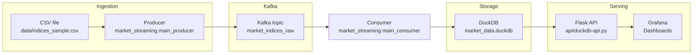
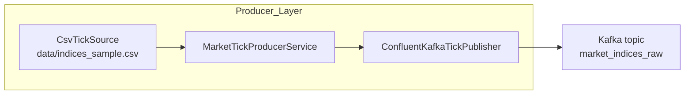
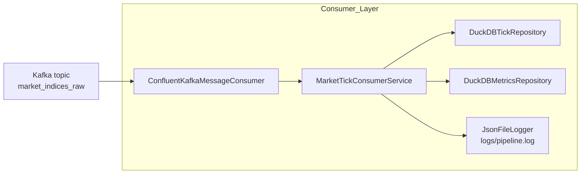
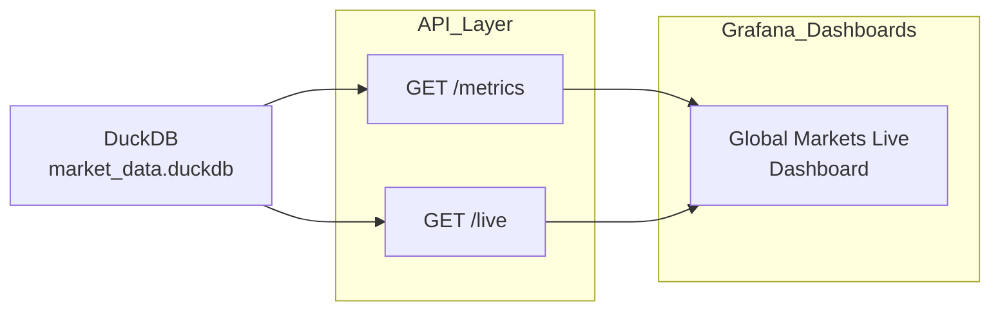
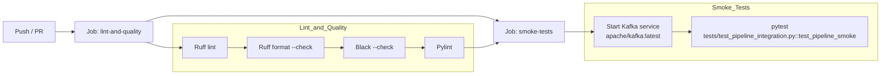

# kafka-market-stream
[](https://github.com/MichaelG-create/kafka-market-stream/actions/workflows/ci.yml)


kafka-market-stream is an end‑to‑end streaming prototype that ingests market index data into Kafka, persists it to DuckDB, and exposes live dashboards in Grafana, with CI smoke tests on GitHub Actions.

***

## Overview

This project simulates a real‑time **market indices** feed (SP500, STOXX600, NIKKEI225) and demonstrates a full data path from CSV → Kafka → DuckDB → HTTP API → Grafana dashboards.  
It is designed as a portfolio piece for data engineering roles, with clear separation between domain, application services, infrastructure, monitoring, and CI.

---

## High‑Level Architecture



Synthetic CSV data is streamed into Kafka, consumed into DuckDB, then exposed via an HTTP API and visualized in Grafana.

***

## Architecture

The repository is structured as a Python package `market_streaming` with application services, ports, and infrastructure adapters, plus an API and Grafana configuration.

- **Producer path**  
  - `data/indices_sample.csv` contains synthetic index ticks generated by `data/generate_sample_data.py`.  
  - `src/market_streaming/main_producer.py` builds a `MarketTickProducerService` using `CsvTickSource` and `ConfluentKafkaTickPublisher` to send JSON messages into Kafka topic `market_indices_raw` (overridable via `KAFKA_TOPIC`).

- **Consumer path**  
  - `src/market_streaming/main_consumer.py` builds a `MarketTickConsumerService` wired with `ConfluentKafkaMessageConsumer`, `DuckDBTickRepository`, `DuckDBMetricsRepository`, and `JsonFileLogger`.  
  - Messages are read from Kafka, converted to `MarketTick` domain objects, inserted into DuckDB table `market_ticks`, and run‑level metrics are written into `pipeline_metrics`.

- **Storage & analytics**  
  - `DuckDBTickRepository` and `DuckDBMetricsRepository` persist data into `data/market_data.duckdb` or a custom path via `MARKET_DB_PATH`.  
  - `data/duckdb_once_setup_grafana.py` adds schema extras (for example `timestamp_received`, `market_metrics` and `live_ticks` views) used by dashboards.

- **API & dashboards**  
  - `api/duckdb-api.py` exposes `/metrics` and `/live` endpoints backed by DuckDB queries, returning JSON enriched with a `time` field.  
  - `docker-compose.grafana.yml` defines a `grafana` service and a `duckdb-api` service; Grafana uses these endpoints to visualize prices, volumes, and summary metrics.

- **DevOps & CI**  
  - `.github/workflows/ci.yml` runs linting (ruff, black, pylint) and a smoke integration test against a Kafka service on every push.  
  - `tests/test_pipeline_integration.py` runs `./scripts/run_pipeline.sh`, then validates that DuckDB contains exactly 150 rows in `market_ticks`, with variants that assume Kafka is running or auto‑launch Kafka via Docker.

***

## Producer Design



- `CsvTickSource` reads rows from the CSV and converts them into `MarketTick` domain objects.  
- `MarketTickProducerService` iterates over ticks, applies an optional delay, and hands them to the publisher, printing progress every N messages.  
- `ConfluentKafkaTickPublisher` serializes ticks to JSON and publishes them to Kafka with delivery callbacks.

***

## Consumer & Monitoring Design



- `ConfluentKafkaMessageConsumer` polls Kafka and returns raw payloads.  
- `MarketTickConsumerService` decodes JSON, builds `MarketTick` objects, writes them to DuckDB, and tracks run metrics such as message count, errors, elapsed seconds, and max timestamp.  
- `DuckDBMetricsRepository` persists `RunMetrics` into `pipeline_metrics`, while `JsonFileLogger` writes structured JSON logs for start, end, and error events.

---

## Grafana & API Design



- `/metrics` computes per‑symbol aggregates (tick count, average, max, min price) and adds a `time` field for time‑series panels.  
- `/live` reshapes recent ticks into a wide format with SP500, STOXX600, NIKKEI225 price and volume columns.  
- The dashboard consumes these endpoints via the Infinity data source to render timeseries, tables, and stat panels.

***

## Tech Stack

- **Streaming & messaging**: Apache Kafka via `confluent-kafka` producer/consumer wrappers.  
- **Language & structure**: Python package `market_streaming` with dataclasses, Protocol‑based ports, and layered application design.  
- **Storage**: DuckDB as embedded OLAP store for `market_ticks` and `pipeline_metrics`.  
- **Web/API**: Flask REST API exposing `/metrics` and `/live` (with CORS).  
- **Dashboards**: Grafana with Yesoreyeram Infinity datasource consuming JSON from the DuckDB API.  
- **Tooling & quality**: `ruff`, `black`, `pylint`, `pytest`, and `uv` within GitHub Actions CI.

***

## Setup and Usage

### 1. Prerequisites

- Python 3.x and ability to install the project’s Python dependencies.  
- Kafka broker reachable at `localhost:9092` (for example via Docker).  
- Docker and Docker Compose to run Grafana and the DuckDB API (`docker-compose.grafana.yml`).

### 2. Install Python dependencies

From the project root:

```bash
# Using uv (aligned with CI)
uv pip install -r src/kafka_market_stream.egg-info/requires.txt
```

### 3. Generate sample market data

```bash
python data/generate_sample_data.py
```

This creates `data/indices_sample.csv` with 150 rows (50 per symbol) of timestamped price and volume data.

### 4. Start Kafka

Start Kafka in your preferred way (Docker, local install, etc.) and ensure it listens on `localhost:9092`.  
You can also rely on `scripts/run_pipeline.sh` (used by tests) if it encapsulates Kafka startup for you.

### 5. Run the streaming pipeline locally

```bash
# 1) Run producer – stream CSV → Kafka
PYTHONPATH=src python -m market_streaming.main_producer

# 2) Run consumer – Kafka → DuckDB, metrics + logs
PYTHONPATH=src python -m market_streaming.main_consumer
```

- Producer reads from `data/indices_sample.csv` and publishes JSON payloads to `market_indices_raw` (or `KAFKA_TOPIC`).  
- Consumer polls Kafka, writes rows into `market_ticks`, and records run metrics into `pipeline_metrics`, with logs in `logs/pipeline.log`.

Environment overrides:

```bash
export MARKET_DB_PATH=/path/to/custom.duckdb
export KAFKA_TOPIC=my_custom_topic
```

### 6. Prepare DuckDB schema for Grafana (optional)

```bash
python data/duckdb_once_setup_grafana.py
```

This adds `timestamp_received`, a `market_metrics` view aggregating tick statistics by symbol, and a `live_ticks` view limiting to the latest records.

***

## Grafana Dashboards

### 1. Start Grafana + DuckDB API

From the project root:

```bash
docker compose -f docker-compose.grafana.yml up --build
```

This starts:

- `duckdb-api` on port `8080`, exposing:
  - `/metrics` with `symbol`, `tick_count`, `avg_price`, `max_price`, `min_price`, plus a `time` column.  
  - `/live` returning a wide time‑series of SP500, STOXX600, NIKKEI225 prices and volumes.
- `grafana` on port `3000`, mounting the repository so dashboards can be imported.

### 2. Global Markets Live dashboard

A ready‑to‑import Grafana dashboard is available at:

```text
dashboard/grafana_dashboard_settings.json
```

It defines the **“🌍 Global Markets - Live Dashboard”**, which includes:

- Live price trends for SP500, STOXX600, NIKKEI225 based on `/live`.  
- Stacked trading volume chart for the three indices.  
- Stat panels showing latest prices per index.  
- A “Market Statistics Summary” table driven by `/metrics` with tick counts and min/avg/max prices plus gradient coloring.  

To import it:

1. In Grafana, go to “Dashboards” → “New” → “Import”.  
2. Upload `dashboard/grafana_dashboard_settings.json` or paste its contents.  
3. Select the Infinity datasource configured to query `http://duckdb-api:8080`.

***

## Tests and CI



- **Lint & quality job**  
  - Installs `uv`, then the dev tools `ruff`, `black`, and `pylint`.  
  - Runs `ruff check`, `ruff format --check`, `black --check .`, and `pylint` on the codebase.

- **Smoke-tests job**  
  - Starts `apache/kafka:latest` as a service on port `9092`.  
  - Runs `python -m pytest tests/test_pipeline_integration.py::test_pipeline_smoke -v` with `PYTHONPATH=src`.

The integration tests validate:

- `test_pipeline_smoke`: assumes Kafka is running, executes `./scripts/run_pipeline.sh`, asserts `"SUCCESS"` in logs and `150` rows in `market_ticks`.  
- `test_pipeline_kafka_autolaunch`: stops any existing Kafka containers, runs `run_pipeline.sh` to auto‑start Kafka, then performs the same checks.

***

## Monitoring & Metrics

The consumer records run‑level pipeline metrics and structured logs to support a monitoring mindset.

- **Run metrics**  
  - `RunMetrics` stores `run_started_at`, `run_ended_at`, `elapsed_seconds`, `messages_processed`, `errors`, and `max_timestamp`.  
  - `DuckDBMetricsRepository` persists each run into DuckDB table `pipeline_metrics`.

- **Structured logs**  
  - `JsonFileLogger` writes JSON lines to `logs/pipeline.log` with event names, timestamps, counters, and error details.  
  - `MarketTickConsumerService` logs pipeline start/end and any message processing errors.

These metrics can be used for future Grafana panels tracking throughput, error rates, and run duration.

---
## Inspiration & related work

This prototype mirrors common streaming patterns where Kafka handles ingestion and DuckDB provides an embedded analytics store refreshed by micro‑batches or streaming jobs.

Similar ideas appear in public examples that join Kafka topics and land the results into analytical stores exposed to BI tools, which aligns with this project’s Kafka → DuckDB → Grafana path. 
